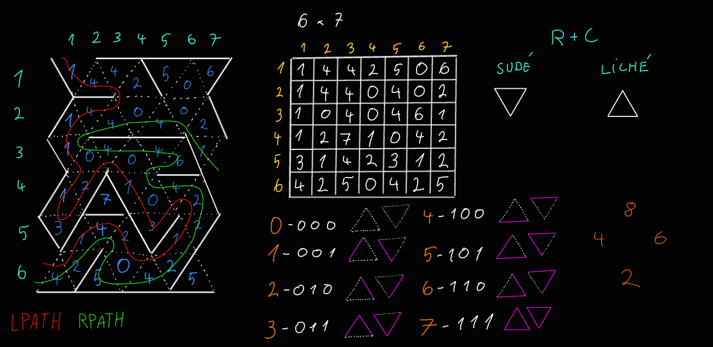

# Projekt: Maze

Tento projekt implementuje program na nájdenie cesty v bludisku reprezentovanom číselnou maticou v textovom súbore. Podporuje overenie validity bludiska a nájdenie cesty pomocou pravidla pravej a ľavej ruky.

## Zadanie a Pravidlá

Cieľom projektu bolo vytvoriť program v jazyku C, ktorý spracuje mapu bludiska uloženú v textovom súbore a nájde v ňom cestu z určeného vstupného bodu k východu. Bludisko je reprezentované ako mriežka trojuholníkových políčok, ktorých hranice sú definované 3-bitovým číslom pre každé políčko.

Program musí byť spustiteľný z príkazového riadku s rôznymi argumentmi:

* `./maze --help`: Vytlačí nápovedu použitia programu.
* `./maze --test soubor.txt`: Overí validitu formátu a obsahu súboru s bludiskom. Vypíše "Valid" alebo "Invalid".
* `./maze --rpath R C soubor.txt`: Nájde a vypíše cestu z políčka [R, C] pomocou pravidla pravej ruky.
* `./maze --lpath R C soubor.txt`: Nájde a vypíše cestu z políčka [R, C] pomocou pravidla ľavej ruky.
* `./maze --shortest R C soubor.txt`: (Nepovinné/Prémiové) Nájde a vypíše najkratšiu cestu z políčka [R, C]. (Táto časť nie je implementovaná v priloženom kóde).

Súradnice R a C sú 1-založené (riadok, stĺpec). Výstupom cesty je sekvencia súradníc navštívených políčok, každá na novom riadku vo formáte `riadok,stĺpec`.

Mapa bludiska je validná, ak:
* Obsahuje správny počet riadkov a stĺpcov deklarovaných na začiatku.
* Všetky hodnoty políčok sú platné (0-7).
* Susediace políčka majú konzistentné definície zdieľaných hraníc.

## Ako Program Implementuje Riešenie

Program `maze.c` implementuje riešenie na základe požiadaviek zadania.

1.  **Štruktúra Mapy:** Bludisko je reprezentované pomocou štruktúry `Map`, ktorá obsahuje rozmery bludiska (`rows`, `cols`) a ukazovateľ na jednorozmerné pole (`unsigned char *cells`), kde sú uložené hodnoty jednotlivých políčok. Políčka sú v pamäti uložené riadok po riadku.
2.  **Validácia Bludiska (`isMazeValid`):** Táto funkcia načíta rozmery a hodnoty políčok zo súboru. Skontroluje, či počet načítaných hodnôt zodpovedá deklarovaným rozmerom, či sú hodnoty v rozsahu 0-7, a čo je kľúčové pre validitu, prejde všetkými políčkami a overí konzistenciu zdieľaných hraníc medzi susedmi.
3.  **Kontrola Hraníc (`isborder`):** Podľa zadania je implementovaná funkcia `isborder(Map *map, int r, int c, int border)`. Táto funkcia sa používa na zistenie, či má políčko na súradnici [r, c] stenu na danej hranici (`border`). Týmto sa abstrahuje prístup k dátam v `map->cells` a zabezpečí sa, že sa pri kontrole hranice správne interpretuje 3-bitová hodnota políčka a typ hranice (ľavá šikmá, pravá šikmá, horná/dolná na základe parity súčtu riadku a stĺpca).
4.  **Určenie Štartovacej Hranice (`start_border`):** Funkcia `start_border(Map *map, int r, int c, int leftright)` určí, ktorú hranicu má program "sledovať rukou" pri vstupe do bludiska na pozícii [r, c], v závislosti od zvoleného pravidla (`RPATH` alebo `LPATH`). Implementuje špecifikované priority pre `RPATH` a analogicky pre `LPATH`.
5.  **Pohyb a Navigácia (`moveForward`, `goRight`, `turnLeft`, `goLeft`, `turnRight`):**
    * `moveForward` posunie aktuálnu pozíciu v bludisku o jedno políčko v určenom smere (`facing`), pričom zohľadňuje, či je aktuálne políčko "normálny" alebo "otočený" trojuholník (podľa parity súčtu riadku a stĺpca).
    * Funkcie `goRight`, `turnLeft`, `goLeft`, `turnRight` slúžia na zmenu smeru (`facing`) v rámci jedného políčka alebo pri prechode na ďalšie, pričom simulujú správanie pravidla pravej alebo ľavej ruky v závislosti od typu aktuálneho políčka.
6.  **Algoritmy Hľadania Cesty (`RightHand`, `LeftHand`):**
    * Funkcie `RightHand` a `LeftHand` implementujú iteratívne hľadanie cesty. Začínajú na určenom vstupnom políčku a s určeným počiatočným smerom. V každom kroku skontrolujú, či je pred nimi stena (pomocou `isborder`).
    * Ak nie je stena, posunú sa vpred (`moveForward`), vytlačia súradnice aktuálneho políčka a potom "pritisnú ruku" k stene (otočia sa doprava pre pravú ruku, doľava pre ľavú ruku pomocou `goRight`/`goLeft`).
    * Ak je stena, otočia sa od steny (doľava pre pravú ruku, doprava pre ľavú ruku pomocou `turnLeft`/`turnRight`) a na novej pozícii (stále na tom istom políčku) znova kontrolujú, či môžu ísť vpred.
    * Proces pokračuje, kým sa nedostanú mimo hranice bludiska (čo signalizuje nájdenie východu).
7.  **Spracovanie Argumentov a Hlavná Funkcia (`main`):** Hlavná funkcia spracuje argumenty príkazového riadku, otvorí súbor s bludiskom, načíta a validuje mapu, a následne zavolá príslušnú funkciu na testovanie (`isMazeValid`) alebo hľadanie cesty (`RightHand`, `LeftHand`) podľa požiadavky užívateľa. Zabezpečuje uvoľnenie alokovanej pamäte a zatvorenie súboru.

## Usage

* `./maze --help`
* `./maze --test soubor.txt`
* `./maze --rpath R C soubor.txt`
* `./maze --lpath R C soubor.txt`

Popis argumentov a parametrov:
*   `--help`: Vytlačí nápovedu.
*   `--test soubor.txt`: Overí validitu súboru `soubor.txt`.
*   `--rpath R C soubor.txt`: Hľadá cestu pravou rukou zo súradníc `R` (riadok), `C` (stĺpec) v súbore `soubor.txt`.
*   `--lpath R C soubor.txt`: Hľadá cestu ľavou rukou zo súradníc `R`, `C` v súbore `soubor.txt`.
*   `R`: Štartovací riadok (1-založený).
*   `C`: Štartovací stĺpec (1-založený).
*   `soubor.txt`: Cesta k textovému súboru s mapou bludiska.

## Formát Vstupného Súboru

Vstupný súbor je textový súbor obsahujúci celé čísla oddelené bielymi znakmi.
Prvé dve čísla sú počet riadkov (R) a počet stĺpcov (C) bludiska.
Nasleduje R*C čísel reprezentujúcich políčka bludiska, uložené po riadkoch.

Každé číslo políčka je 3-bitová hodnota (0-7), ktorá definuje jeho hranice:
    Najnižší bit (hodnota 1): Ľavá šikmá hranica
    Druhý najnižší bit (hodnota 2): Pravá šikmá hranica
    Tretí najnižší bit (hodnota 4): Horná alebo spodná hranica (závisí od políčka)

Typ políčka (a teda význam tretieho bitu) závisí od parity súčtu jeho súradníc (riadok + stĺpec):

    Ak je súčet r + c párny, políčko má hornú hranicu.
    Ak je súčet r + c nepárny, políčko má spodnú hranicu.

Príklad: Políčko s hodnotou 5 (binárne 101) má stenu na ľavej šikmej hranici (bit 0 = 1) a na hornej/spodnej hranici (bit 2 = 1), pravá šikmá hranica je voľná (bit 1 = 0).

## Formát Výstupu

Program vypisuje súradnice políčok na ceste, každú na nový riadok. Súradnice sú vo formáte riadok,stĺpec a sú 1-založené.

## Príklady Vstupu a Výstupu

Použijeme príklad bludiska popísaný v zadaní.

### Vstupný súbor (napr. `inputs/Tests/MazeTest.txt`)

```text
6 7
1 4 4 2 5 0 6
1 4 4 0 4 0 2
1 0 4 0 4 6 1
1 2 7 1 0 4 2
3 1 4 2 3 1 2
4 2 5 0 4 2 5
```

### Príklad spustenia a výstupu pre `--rpath 6 1`

```
./maze --rpath 6 1 inputs/Tests/MazeTest.txt
6,1
6,2
5,2
5,3
5,4
6,4
6,3
6,4
6,5
6,6
5,6
5,7
4,7
4,6
4,5
4,4
3,4
3,5
3,6
3,5
3,4
3,3
3,2
3,1
2,1
2,2
2,3
2,4
2,5
2,6
2,7
3,7
```

### Príklad spustenia a výstupu pre `--lpath 6 1`

```
./maze --lpath 6 1 inputs/Tests/MazeTest.txt
6,1
6,2
5,2
5,3
5,4
6,4
6,5
6,6
5,6
5,7
4,7
4,6
4,5
5,5
4,5
4,4
3,4
3,3
3,2
4,2
4,1
5,1
4,1
4,2
3,2
3,1
2,1
2,2
2,3
2,4
1,4
1,3
1,2
1,1
```

